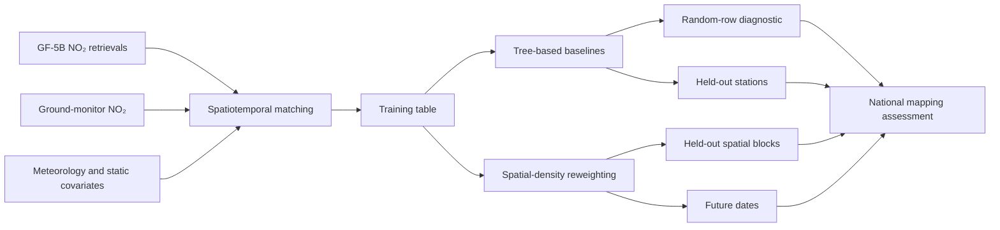
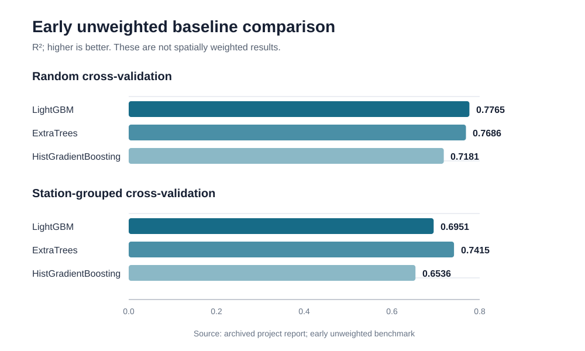
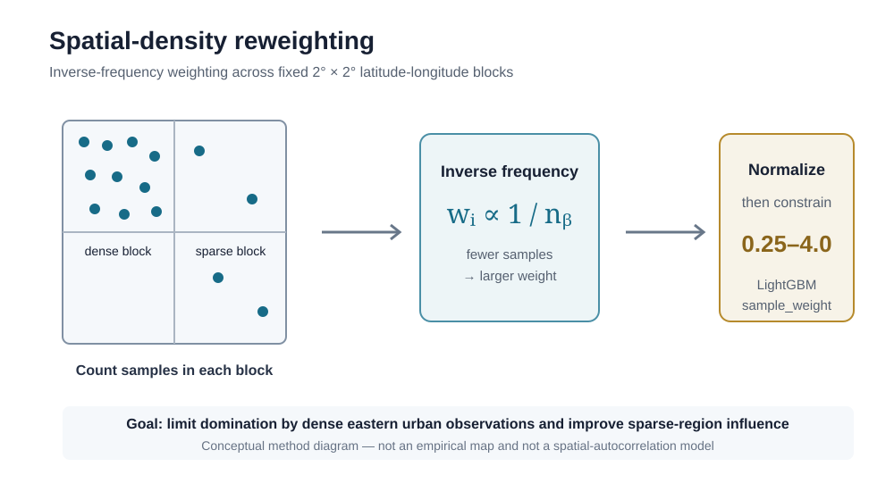

# GF5B NO₂ Gap Filling

Research showcase for estimating near-surface nitrogen dioxide (NO₂) from GF-5B satellite observations, meteorology, static spatial covariates, and ground monitoring data. The project focuses on robust national-scale mapping under satellite-data gaps and geographically uneven monitoring density.

> **Status:** Active research. Results shown here are preliminary and are separated by evaluation protocol. This repository intentionally contains documentation and disclosure-safe figures only.

## Overview

GF-5B provides valuable information on atmospheric NO₂ columns, while ground monitors measure near-surface concentrations at specific locations. This project studies how these complementary sources, together with meteorological and static spatial predictors, can support daily near-surface NO₂ estimation and gap filling across China.

The current work compares tree-based baselines, develops spatially aware evaluation protocols, and tests a sample-weighting strategy designed for a strongly imbalanced monitoring network. It is a research showcase rather than a reproducibility package: restricted data, source code, trained models, and server configurations are not included.

## Research motivation

National air-quality mapping must generalize beyond densely monitored urban regions. A model can score well under random row-level cross-validation while learning repeated station-specific patterns and being dominated by eastern urban observations. The central methodological question is therefore not only whether a model predicts held-out rows, but whether it transfers to unseen stations, sparsely monitored regions, spatial blocks, and later dates.

## Gap-filling task definition

The target is near-surface NO₂ at approximately the GF-5B overpass time. Ground observations at 10:00 and 11:00 local time are paired and averaged to represent 10:30. Two related prediction settings are studied:

1. **Satellite-assisted estimation:** GF-5B tropospheric vertical column density is used together with meteorology, location, calendar, population, elevation, and land-cover features when available.
2. **Satellite-gap filling:** the model excludes same-day satellite NO₂ and predicts from meteorological, temporal, and static spatial information. This setting targets locations or dates where usable satellite retrievals are absent.

The methods are summarized in [METHODS.md](METHODS.md).

## Data and missingness characteristics

- Ground observations are point measurements, whereas GF-5B and meteorological products are gridded and require spatial and temporal matching.
- The early benchmark report records **271,832 matched station-time samples**. The underlying records are not distributed here.
- Satellite availability is spatially and temporally incomplete because of orbital coverage, retrieval quality, and product filtering. Missingness should not be treated as independent random noise.
- A single daily map may contain orbit-striping, stitching texture, and uncovered pixels. Multi-day products require an explicit valid-observation count rather than silently filling all pixels.
- The monitoring network is geographically imbalanced: dense eastern urban clusters contribute many more training samples than sparse western and rural regions.

## Baseline methods

The early, **unweighted** benchmark compared LightGBM, ExtraTrees, and HistGradientBoosting. It used both random cross-validation and station-grouped cross-validation. A separate current two-year production-baseline script also uses an **unweighted random 80:20 split** with early stopping; it must not be interpreted as a spatially weighted production model.

The figure reports the archived early benchmark only. It does **not** report the later spatially weighted LightGBM experiments.

## Spatial sampling imbalance

Random row-level splitting can place observations from the same station in both training and validation sets. It also gives dense monitoring regions influence roughly proportional to their sample count. These properties can overstate transferability and bias the objective toward well-monitored eastern cities.

## Spatial-structure-informed sample weighting

To reduce the dominance of densely monitored urban regions, I implemented **spatial-structure-informed sample weighting**, also described as **spatial-density reweighting** or **inverse-frequency weighting across spatial blocks**.

The study domain is divided into 2° × 2° latitude-longitude blocks. If block \(b\) contains \(n_b\) training samples, a sample \(i\) in that block receives an initial weight approximately proportional to

\[
w_i \propto \frac{1}{n_b}.
\]

The weights are normalized, constrained to 0.25–4.0, and passed to LightGBM through `sample_weight`. This reduces the excessive contribution of dense eastern urban blocks while giving sparse regions a more reasonable influence for national mapping.

This is **not** a full spatial-autocorrelation model. It does not directly estimate Moran's I, a semivariogram, a spatial covariance function, or a data-driven correlation length. The design is implemented in the v3–v8 LightGBM experiments and is currently being evaluated; it is not yet established as part of the final production model.

## Evaluation design

The evaluation plan separates four questions:

| Split | Question | Current reporting status |
|---|---|---|
| Random rows | Can the model interpolate among samples from the observed station network? | Early unweighted metrics available |
| Held-out stations | Can the model transfer to monitoring locations excluded from training? | Early unweighted grouped-CV metrics available |
| Held-out 2° spatial blocks | Can the model transfer to spatial regions excluded from training? | Protocol implemented; complete public result not yet confirmed |
| Future dates | Can the model generalize to later periods without temporal leakage? | Protocol implemented; complete public result not yet confirmed |

Model comparison uses R², RMSE, MAE, and bias. Spatial-block summaries and high-concentration bias are also part of the broader evaluation design. Metrics from different splits or weighting schemes are never pooled.

## My contributions

Within this project, my work focuses on:

- organizing a GF-5B single-satellite workflow for overpass-time ground matching and near-surface NO₂ estimation;
- developing LightGBM baselines and evaluation splits for random rows, held-out stations, held-out spatial blocks, and future dates;
- implementing the 2° × 2° spatial-density reweighting strategy and passing the resulting weights to LightGBM;
- separating satellite-assisted estimation from no-satellite gap filling; and
- building diagnostics for spatial support, high-value bias, temporal transfer, and national map quality.

## Preliminary findings

These results belong to the early **unweighted** benchmark:

| Evaluation | Model | R² | RMSE | MAE | Interpretation |
|---|---:|---:|---:|---:|---|
| Random cross-validation | LightGBM | **0.7765** | 6.7550 | 4.7577 | Best R² among the three early random-CV baselines |
| Station-grouped cross-validation | LightGBM | 0.6951 | 7.8855 | 5.6331 | Lower performance when stations are excluded from training |
| Station-grouped cross-validation | ExtraTrees | **0.7415** | 7.2597 | 5.0321 | Best early held-out-station result among the compared models |

The gap between random and station-grouped validation is consistent with the need for stricter spatial evaluation. It is not evidence that spatial weighting has already improved the model. The v3–v8 experiments are the experiments that pass spatial weights to LightGBM's `sample_weight`, and those weighted results remain under evaluation.

## Limitations

- Random cross-validation can be optimistic because the same station may appear in training and validation.
- Ground monitors are not a spatially uniform reference network.
- Satellite gaps and retrieval filtering create structured missingness.
- A 2° block is a pragmatic discretization, not an estimated atmospheric correlation scale.
- The early benchmark covers a limited research stage and should not be interpreted as a finalized national product.
- Independent spatial-block and future-date results are not reported here because complete, disclosure-ready outputs were not confirmed in the audited local files.

## Current status

**This project is currently under active development. Source code and research data are not yet publicly available.**

The spatial-density weighting implementation exists in the experimental training pipeline and is currently being evaluated. The current two-year production baseline remains an unweighted random 80:20 design. Model selection, independent-date testing, and national spatial admission checks are ongoing.

## Future work

- Complete matched held-out-station, held-out-block, and future-date comparisons for weighted and unweighted models.
- Quantify performance by monitoring density, elevation, region, season, and concentration range.
- Evaluate uncertainty and robustness under satellite missingness and domain shift.
- Compare spatial-density weighting with spatially explicit statistical and machine-learning approaches.
- Validate national maps on additional dates and document valid-pixel support.

## Data and code availability

This public repository contains only research documentation and figures reconstructed from verified aggregate results. It excludes raw or derived GF-5B records, monitoring-station records, meteorological data, restricted third-party inputs, source code whose redistribution rights are not confirmed, trained models, checkpoints, caches, logs, and server details.

**This project is currently under active development. Source code and research data are not yet publicly available.**

No license is granted for reuse at this stage. Please contact the project owner before reusing figures or text.

## Contact

For academic questions or collaboration, please open an issue in this repository. A direct institutional contact can be added after the public affiliation and preferred email address are confirmed.
